准确的轨迹跟踪控制是保证车辆动力学稳定性的基础。提出了一种提高四轮独立驱动电动汽车动力学稳定性的使能轨迹跟踪方案。首先，通过构造三维相位轨迹，提出了一种改进的相位平面法来评估车辆的动力学稳定性。然后，采用变刚度轮胎模型的模型预测控制算法，设计了横向轨迹跟踪控制器。考虑附加偏航力矩对轨迹跟踪误差和飞行器偏航稳定性的影响，建立了一种双权重协同滑模控制方法，通过目标切换实现偏航角跟踪补偿和偏航稳定性控制。最后，在考虑滑移率的情况下，通过车轮扭矩分配获得所需的额外偏航力矩和总纵向轮胎力。通过双车道变换机动下的硬件在环综合测试，对该方法的性能进行了评价。

| **算法**             | **核心思想**                                             | **关键公式**     |
| -------------------- | -------------------------------------------------------- | ---------------- |
| **改进相平面法**     | 三维相轨迹评估稳定性，结合侧滑角约束判断工况             | 式 75, 图 3-4    |
| **MPC** **横向控制** | 滚动时域优化，变刚度轮胎模型提升非线性工况精度           | 式 18-21         |
| **双权重滑模**       | 动态切换横摆稳定性与轨迹跟踪目标，权重系数由工况实时计算 | 式 25-31, 图 7-9 |
| **SMC** **纵向控制** | 滑模控制抑制车速误差，鲁棒性强                           | 式 33-34         |
| **扭矩分配**         | 多目标优化分配四轮扭矩，平衡横摆力矩与轮胎载荷           | 式 38-46         |

## **第二章：系统建模（Section 2）**

#### **2.1 车辆动力学与运动学模型**

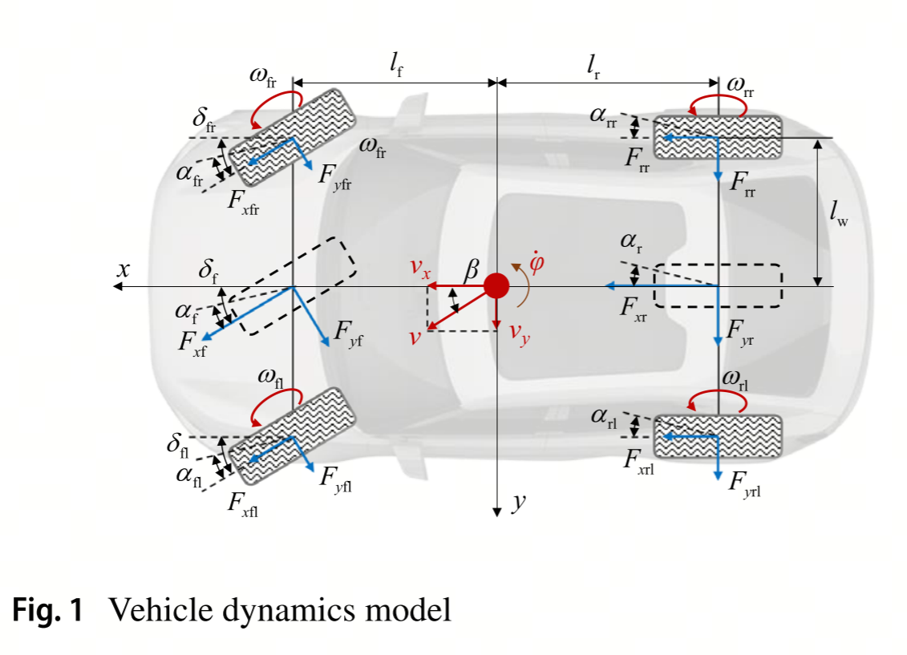

##### **公式 1：3 自由度车辆动力学模型**

$ 
\begin{cases}
m(\dot{v}_x - v_y \dot{\varphi}) = F_{xf}\cos\delta_f - F_{yf}\sin\delta_f + F_{xr} + F_r \quad (1-1)\\
m(\dot{v}_y + v_x \dot{\varphi}) = F_{xf}\sin\delta_f + F_{yf}\cos\delta_f + F_{yr} \quad (1-2)\\
I_{zz}\ddot{\varphi} = (F_{xf}\sin\delta_f + F_{yf}\cos\delta_f)l_f - F_{yr}l_r \quad (1-3)
\end{cases}
 $

*   **物理意义**：

    *   **纵向运动（1-1）**：左侧为惯性力（质量 × 加速度），右侧为纵向力合力（前轮纵向力分量 $F_{xf}\cos\delta_f$、后轮纵向力 $F_{xr}$、行驶阻力 $F_r$）与横向力的纵向分量（$-F_{yf}\sin\delta_f$）。
    
    *   **横向运动（1-2）**：左侧为惯性力，右侧为横向力合力（前轮横向力分量 $F_{yf}\cos\delta_f$、后轮横向力 $F_{yr}$）与纵向力的横向分量（$F_{xf}\sin\delta_f$）。
    
    *   **横摆运动（1-3）**：左侧为转动惯量 × 角加速度，右侧为车轮力对质心的力矩（前轮力矩 $F_{xf}\sin\delta_f \cdot l_f + F_{yf}\cos\delta_f \cdot l_f$，后轮力矩 $-F_{yr} \cdot l_r$）。

*   **假设与简化**：忽略俯仰 / 侧倾运动，适用于平坦路面的紧急避障场景，简化计算但保留纵向、横向、横摆三自由度。

##### **公式 2：行驶阻力模型**

$ 
F_r = F_a + F_g + F_{\omega} \quad (2)
 $

*   **组成**：
*   $F_a$：空气阻力，与车速平方成正比；

*   $F_g$：坡度阻力，本文假设路面平坦（$F_g=0$）；

*   $F_{\omega}$：滚动阻力，与轮胎特性和载荷相关。

*   **作用**：用于纵向动力学计算，简化后仅考虑 $F_a$ 和 $F_{\omega}$。

##### **公式 3：四轮垂直载荷计算**

$ 
\begin{cases}
F_{zfl} = \frac{mgl_r}{2(l_f + l_r)} + \frac{mh_g(-a_x l_w - a_y l_r)}{2(l_f + l_r)l_w} \quad (3-1)\\
F_{zfr} = \frac{mgl_r}{2(l_f + l_r)} + \frac{mh_g(a_x l_w + a_y l_r)}{2(l_f + l_r)l_w} \quad (3-2)\\
F_{zrl} = \frac{mgl_f}{2(l_f + l_r)} + \frac{mh_g(a_x l_w - a_y l_r)}{2(l_f + l_r)l_w} \quad (3-3)\\
F_{zrr} = \frac{mgl_f}{2(l_f + l_r)} + \frac{mh_g(a_x l_w + a_y l_r)}{2(l_f + l_r)l_w} \quad (3-4)
\end{cases}
 $

*   **物理意义**：

    *   **静态载荷**：第一项为车辆静态时的轮载分配（与质心前后位置 $l_f, l_r$ 相关）；
    
    *   **动态载荷转移**：第二项为加速 / 转向时的载荷转移（与质心高度 $h_g$、纵向 / 横向加速度 $a_x, a_y$、轮距 $l_w$ 相关）。

*   **应用**：计算各轮垂直载荷 $F_{zij}$，用于轮胎力建模（如 Pacejka 模型中的垂直载荷输入）。

##### **公式 4：轮胎滑移角计算**

$ 
\begin{cases}
\alpha_{fl} = \arctan\left(\frac{v_y + l_f \dot{\varphi}}{v_x - l_w \dot{\varphi}}\right) - \delta_f \quad (4-1)\\
\alpha_{fr} = \arctan\left(\frac{v_y + l_f \dot{\varphi}}{v_x + l_w \dot{\varphi}}\right) - \delta_f \quad (4-2)\\
\alpha_{rl} = \arctan\left(\frac{v_y - l_r \dot{\varphi}}{v_x - l_w \dot{\varphi}}\right) \quad (4-3)\\
\alpha_{rr} = \arctan\left(\frac{v_y - l_r \dot{\varphi}}{v_x + l_w \dot{\varphi}}\right) \quad (4-4)
\end{cases}
 $

*   **定义**：滑移角 $\alpha_{ij}$ 为车轮实际速度方向与滚动方向的夹角。

*   **计算逻辑**：

    *   **前轮（4-1, 4-2）**：考虑转向角 $\delta_f$ 和横摆运动（$l_f \dot{\varphi}$）对速度方向的影响；
    
    *   **后轮（4-3, 4-4）**：仅考虑横摆运动（$l_r \dot{\varphi}$），无转向角。

*   **作用**：用于计算轮胎侧向力 $F_{yij} = C_y \alpha_{ij}$（式 7），反映轮胎非线性特性。

##### **公式 5：轮胎滑移率计算**

$ 
\kappa_{ij} = 
\begin{cases} 
\frac{\omega_{ij}R_w - v_{ij}}{\omega_{ij}R_w}, & \omega_{ij}R_w > v_{ij}\\
\frac{v_{ij} - \omega_{ij}R_w}{v_{ij}}, & \omega_{ij}R_w \leq v_{ij}
\end{cases} = -k_s\left(\left(\frac{v_x}{\omega_{ij}R_w}\right)^{k_s} - 1\right) \quad (5)
 $

*   **物理意义**：滑移率 $\kappa_{ij}$ 表征车轮滑动程度：

    *   $\kappa=0$：纯滚动；$\kappa=1$：完全抱死（制动）或空转（驱动）。

*   **符号函数 **** **：区分驱动（$k_s=1$）与制动（$k_s=-1$）状态，用于统一表达式。

*   **应用**：计算轮胎纵向力 $F_{xij} = C_x \kappa_{ij}$（式 7），是扭矩分配的核心参数。

#### **2.2 轮胎模型**

##### **公式 6：Pacejka 轮胎力模型**

$ 
F_t = D_t \sin\left(C_t \arctan\left(B_t x_t - E_t\left(B_t x_t - E_t\left(B_t x_t\right)\right)\right)\right) \quad (6)
 $

*   **形式**：魔术公式（Magic Formula），描述轮胎力（纵向 / 侧向）与滑移状态（滑移率 / 滑移角）的非线性关系。

*   **参数**：

    *   $B_t$：刚度因子，与路面附着系数 $\mu$ 和垂直载荷 $F_{zij}$ 相关；
    
    *   $C_t$：形状因子，决定曲线峰值位置；
    
    *   $D_t$：峰值力，与 $\mu F_{zij}$ 成正比；
    
    *   $E_t$：曲率因子，调节曲线曲率。

*   **作用**：替代线性轮胎模型，准确描述轮胎在饱和区的非线性特性（如侧偏力饱和）。

##### **公式 7：轮胎刚度与力计算**

$ 
\begin{cases}
F_{xij} = C_x(\kappa_{ij}, \mu, F_{zij}) \kappa_{ij} \quad (7-1)\\
F_{yij} = C_y(\alpha_{ij}, \mu, F_{zij}) \alpha_{ij} \quad (7-2)
\end{cases}
 $

*   **简化假设**：在小滑移范围内，轮胎力近似与滑移率 / 滑移角成正比，刚度 $C_x/C_y$ 由 Pacejka 模型查表得到（$C_k = F_t / x_t$）。

*   **输入参数**：滑移率 $\kappa_{ij}$、滑移角 $\alpha_{ij}$、路面附着系数 $\mu$、垂直载荷 $F_{zij}$。

*   **作用**：快速计算轮胎力，用于车辆动力学模型（式 1）和控制器设计。

##### **公式 8：线性化动力学模型（简化形式）**

$ 
\begin{cases}
\dot{v}_x = v_y \dot{\varphi} + \frac{1}{m}\left(C_{xf} \kappa_f \cos\delta_f - C_{yf} \alpha_f \sin\delta_f + C_{xr} \kappa_r\right) \quad (8-1)\\
\dot{v}_y = -v_x \dot{\varphi} + \frac{1}{m}\left(C_{xf} \kappa_f \sin\delta_f + C_{yf} \alpha_f \cos\delta_f + C_{yr} \alpha_r\right) \quad (8-2)\\
\ddot{\varphi} = \frac{1}{I_{zz}}\left(\left(C_{xf} \kappa_f \sin\delta_f + C_{yf} \alpha_f \cos\delta_f\right)l_f - C_{yr} \alpha_r l_r\right) \quad (8-3)
\end{cases}
 $

*   **推导逻辑**：将式 1 中的轮胎力用式 7 替换，并假设前后轮滑移率 / 滑移角均匀（$\kappa_f, \alpha_f$ 为前轮平均，$\kappa_r, \alpha_r$ 为后轮平均）。

*   **物理意义**：

   *   简化后的纵向 / 横向 / 横摆动力学方程，突出轮胎刚度（$C_{xf}, C_{yf}$）和滑移状态的影响。

*   **应用**：作为模型预测控制（MPC）的状态转移方程（式 18）的基础。

#### **2.3 轨迹跟踪模型**

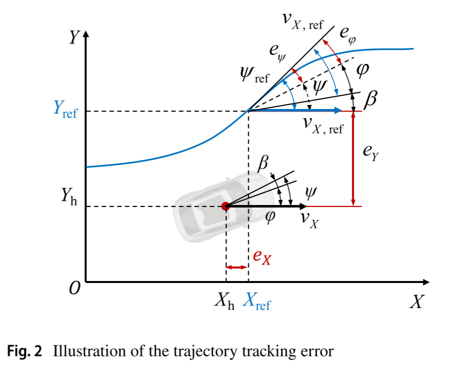

##### **公式 9：轨迹跟踪误差定义**

$ 
\begin{cases}
\dot{x} = Ax + Bu + w \quad (9-1)\\
y = Cx \quad (9-2)
\end{cases}
 $

*   **状态空间表示**：

    *   **状态向量**：$x = [v_x, v_y, \varphi, \dot{\varphi}, X_h, Y_h]^T$（速度、角度、位置）；

*   **控制输入**：$u = \delta_f$（前轮转向角）；

*   **输出**：$y = [Y_h, \varphi]^T$（横向位置、横摆角）。

*   **矩阵形式**：

    *   $A$：状态矩阵，包含车辆动力学参数；
    
    *   $B$：输入矩阵，关联转向角与状态变化；
    
    *   $C$：输出矩阵，提取跟踪误差相关状态。&#x20;

*   **作用**：将非线性动力学模型线性化，用于 MPC 的滚动时域优化（Section 4.1）。

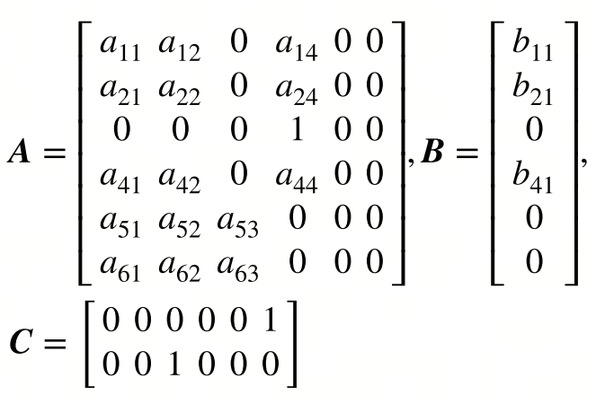

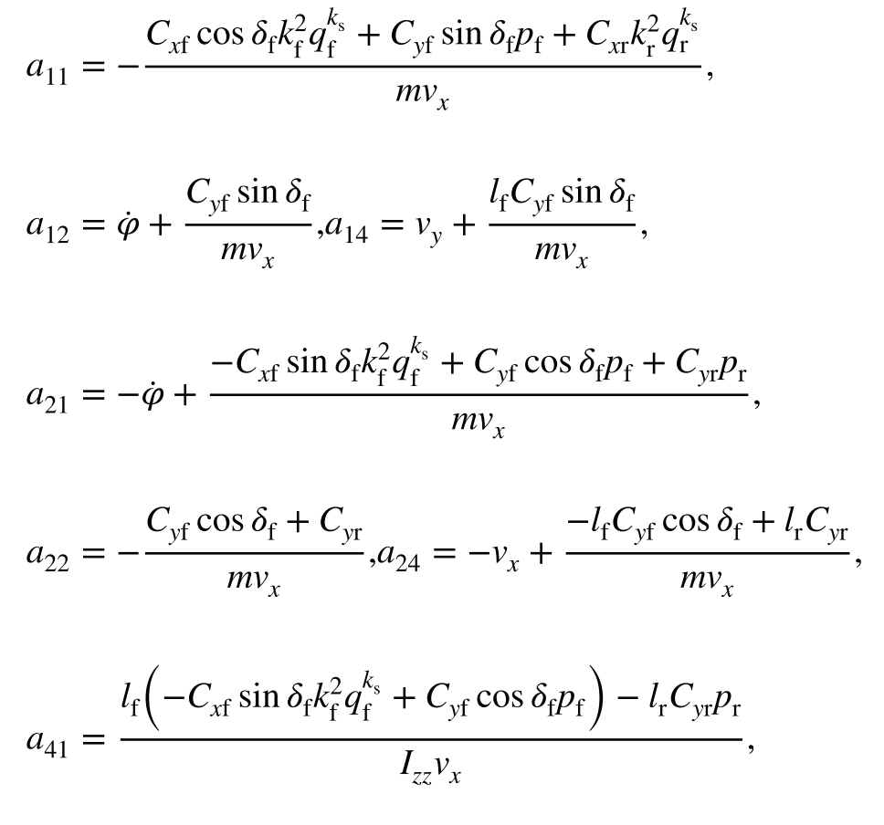

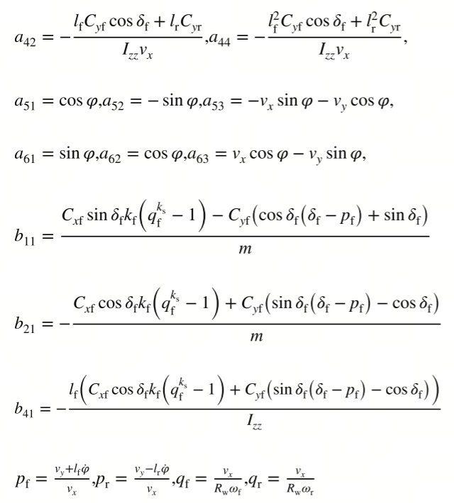

##### **公式 10：纵向速度误差**

$ 
e_{v_X} = v_X - v_{X,\text{ref}} = (v_x \cos\varphi - v_y \sin\varphi) - v_{X,\text{ref}} \quad (10)
 $

*   **定义**：全局坐标系下的纵向速度误差，考虑车辆航向角 $\varphi$ 对速度分量的影响。

*   **物理意义**：用于纵向速度跟踪控制（SMC，Section 4.4），确保车辆沿参考轨迹的速度匹配。

##### **公式 11：速度误差导数**

$ 
\dot{e}_{v_X} = \dot{v}_X - \dot{v}_{X,\text{ref}} = (\dot{v}_x \cos\varphi - \dot{v}_y \sin\varphi) - \dot{\varphi}(v_x \sin\varphi + v_y \cos\varphi) - \dot{v}_{X,\text{ref}} \quad (11)
 $

*   **推导**：对式 10 求导，考虑速度分量的变化率和横摆运动的耦合项（$-\dot{\varphi}(v_x \sin\varphi + v_y \cos\varphi)$）。

*   **作用**：作为纵向滑模控制器（SMC）的输入，设计控制量以消除速度误差。

### **第二章公式关联与章节总结**

1.  \*\* 动力学模型（式 1）\*\* 是整个系统建模的核心，后续公式（轮胎模型、轨迹跟踪）均基于此展开。

2.  \*\* 轮胎模型（式 3-7）\*\* 通过垂直载荷、滑移角 / 率计算轮胎力，将物理量（如质心位置、加速度）与控制量（转向角、扭矩）连接。

3.  \*\* 轨迹跟踪模型（式 8-11）\*\* 将非线性动力学线性化，为控制器设计（MPC、SMC）提供状态空间基础。

第二章通过建模建立了车辆运动、轮胎特性与控制输入的数学关联，为后续稳定性评估与控制器设计奠定了理论基础。

## 第三章：车辆稳定性评估（Section 3）&#xA;

基于方程(1)所述的3-DOF车辆动力学模型，包括车辆尺寸和质量分布在内的车辆参数对系统稳定性有影响，但一般可以认为在车辆单次行程中是固定的，因此轮胎性能是影响相平面形状的主要因素（非线性）。

假设前轮转向角保持不变，且在规定时间内纵向力为零，则轮胎侧向力主要取决于轮胎滑移角。根据方程(4)可以计算出每个车轮的轮胎滑移角，通过查表可以得到不同轮胎角度、垂直载荷、路面摩擦系数下的轮胎转弯刚度。需要注意的是，较大的轮胎侧刚度会导致较宽的稳定区域。

通过将轮胎转弯刚度代入方程(1)，可以绘制出不同初始横向速度、纵向速度、横摆角速度、前轮转向角和路面摩擦系数下的车辆相位轨迹。采用一阶正演欧拉方法对三自由度状态空间方程进行离散化，在MATLAB中迭代计算一定时域内的$v_y-\dot{\varphi}-v_x$相轨迹，实现相轨迹可视化。

稳定性判据的定义如下:一旦获得了$v_y-\dot{\varphi}-v_x$相平面，就可以通过判断相轨迹是否收敛于平衡点来判断车辆的稳定状态。在vx = 20 m/s，$$\mu$$= 0.8，$$\delta_{f}$$=−5°的条件下，对图中不同初始状态下的相轨迹进行分析，结果如下:

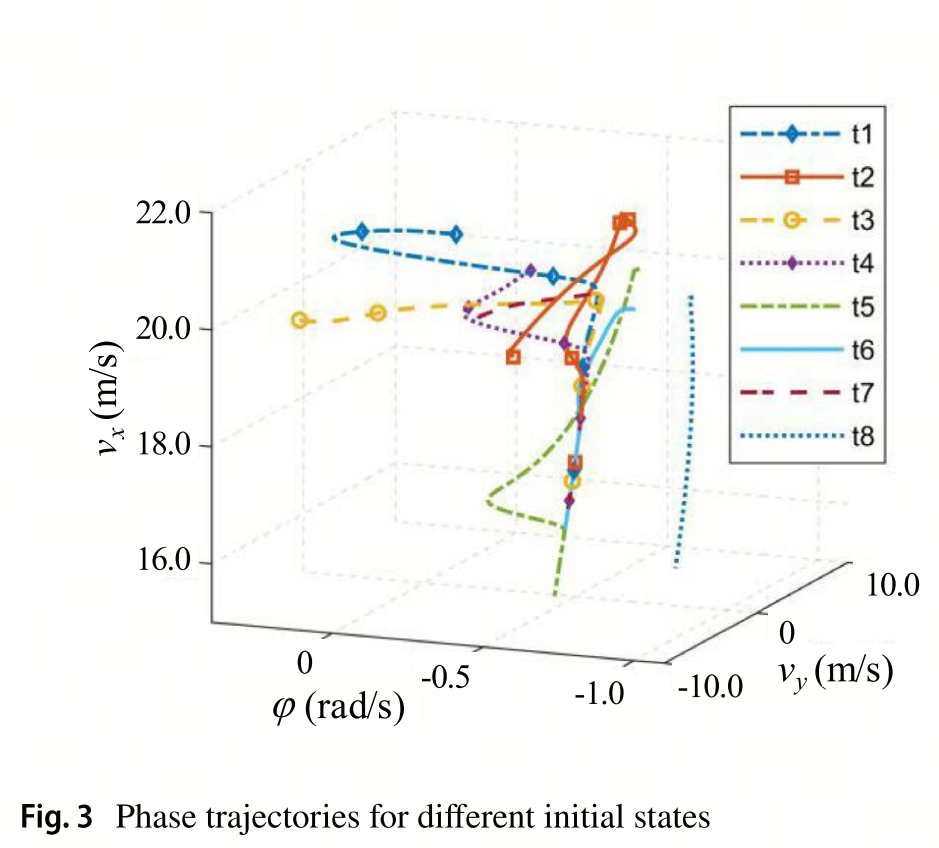

- 在初始值较小的情况下，如t4和t7, $v_y-\dot{\varphi}$变量的相轨迹呈现出明显的平衡点，而vx相对变化变小；
- t2和t5的平衡点在$v_y-\dot{\varphi}$变量相轨迹上也很明显，但vx和vy变化剧烈，导致车速明显增加或减少；
- 在长时间内(5 s)，车速v保持不变的情况下，$v_y-\dot{\varphi}$变量的相轨迹未能达到稳定状态，表现出严重的过转向特征，进入自旋状态，$v_y-\dot{\varphi}$的值大幅度增加。对于收敛相轨迹，它们最终收敛到一个弯曲的“茎”，类似于$v_y-\dot{\varphi}$变量相平面[41]上的稳定点。基于这一特征，相位平面可以分为“稳定”和“不稳定”区域，如图4所示。

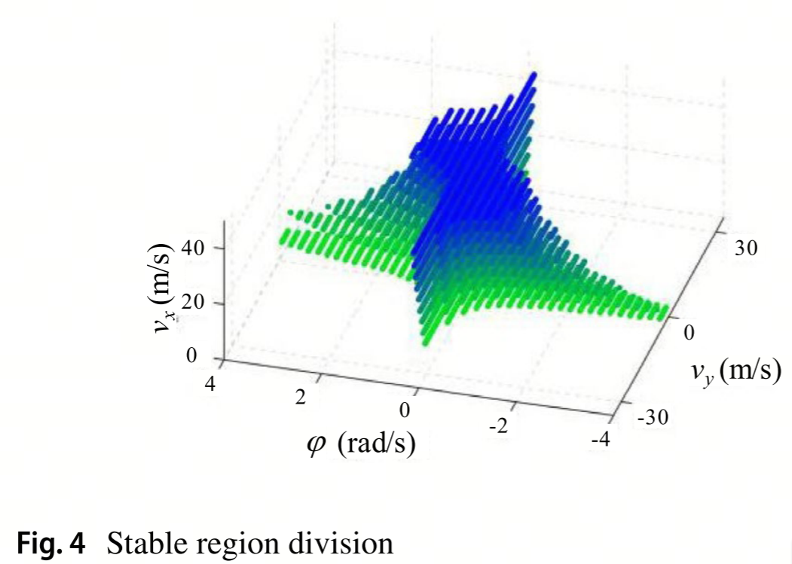

考虑到侧滑角的剧烈变化对驾驶员心理和胎力利用的影响，基于胎路附着椭圆对侧滑角进行了约束。在稳定区域，当相轨迹不满足约束条件时，认为初始状态不稳定;相反，它被认为是稳定的。对侧滑角的约束由式给出：

$ 
\beta_{\text{max/min}} = \frac{l_r \dot{\varphi}}{v_x} \pm \tan(\alpha_{\text{sl}})
 $

*   **推导逻辑**：结合车辆动力学和轮胎特性，考虑后轮横摆运动对侧滑角的影响，以及轮胎峰值力对应的滑移角 $\alpha_{\text{sl}}$ 来确定侧滑角的上下限。

*   **物理意义**：通过限制侧滑角范围，避免轮胎力进入饱和区，防止车辆失稳，为稳定性评估增加约束条件。

*   **应用场景**：在相轨迹分析中，用于筛选出符合侧滑角安全范围的稳定状态，提升稳定性评估的准确性。

##### 公式 相轨迹离散化方程

$ 
\begin{cases}
x_{k+1} = x_k + T_p \dot{x}_k \\
\dot{x}_{k+1} = \dot{x}_k + T_p \ddot{x}_k
\end{cases}
 $

*   **推导逻辑**：采用一阶欧拉法对车辆动力学方程（式 1）进行离散，其中 $x$ 代表状态变量（如 $v_y$、$\dot{\varphi}$、$v_x$），$T_p$ 为离散时间步长。

*   **物理意义**：通过迭代计算下一时刻的状态，构建相轨迹，用于可视化车辆运动状态的变化趋势。

*   **应用场景**：是构建三维相轨迹（$v_y-\dot{\varphi}-v_x$）的核心计算方式，为稳定性评估提供数据基础。

##### 公式 ：稳定茎（curved stem）边界方程

$ 
\dot{\varphi}_{\text{bound}} = f(v_y, v_x)
 $

*   **推导逻辑**：通过大量仿真和理论分析，确定在不同侧向速度 $v_y$ 和纵向速度 $v_x$ 下，车辆保持稳定时横摆率 $\dot{\varphi}$ 的边界函数。

*   **物理意义**：定义了三维相空间中车辆稳定区域的边界，若相轨迹收敛到该边界内，则车辆稳定；反之则不稳定。

*   **应用场景**：作为判断车辆稳定性的核心依据，帮助快速识别车辆是否处于危险状态。

##### 公式 ：稳定性指标（SI）计算

$ 
SI = 
\begin{cases} 
1,  \\
0, 
\end{cases}
 $

*   **推导逻辑**：基于相轨迹的最终状态进行判断，当轨迹超出稳定区域或呈现发散趋势时，认定车辆不稳定。

*   **物理意义**：输出二进制指标 $SI$ 量化车辆稳定性状态，为后续控制器的策略切换提供信号。

*   **应用场景**：直接作用于双权重协同滑模控制（Section 4.2），决定控制目标是优先稳定还是轨迹跟踪。

##### 公式 ：侧滑角误差计算

$ 
e_{\beta} = \beta - \beta_{\text{ref}}
 $

*   **推导逻辑**：将实际侧滑角 $\beta$ 与理想参考侧滑角 $\beta_{\text{ref}}$（通常为 0 或极小值）作差。

*   **物理意义**：量化侧滑角偏离理想状态的程度，用于评估车辆在横向运动中的稳定性。

*   **应用场景**：可作为辅助指标，结合相轨迹和稳定性指标 $SI$ ，更全面地判断车辆稳定性。

##### 公式 ：稳定性状态对控制目标的影响

$ 
\dot{\varphi}_c = 
\begin{cases} 
q_s \dot{\varphi}_{\text{stability}}, & SI = 1 \\
q_t \dot{\varphi}_{\text{track}}, & SI = 0
\end{cases}
 $

*   **推导逻辑**：根据稳定性指标 $SI$ 的值，动态切换横摆率控制目标，其中 $q_s$ 和 $q_t$ 为权重系数（$q_s + q_t = 1$）。

*   **物理意义**：在车辆不稳定时（$SI = 1$），优先以稳定横摆率 $\dot{\varphi}_{\text{stability}}$ 为目标；稳定时（$SI = 0$），聚焦于轨迹跟踪横摆率 $\dot{\varphi}_{\text{track}}$ 。

*   **应用场景**：直接指导双权重协同滑模控制器的参数调整，实现稳定性与轨迹跟踪的协同控制。

## 第四章：协同轨迹跟踪与稳定控制

所提出的协同轨迹跟踪与稳定控制方案示意图如图6所示。运动规划层根据环境感知和车辆状态生成参考轨迹。横向轨迹跟踪控制器计算前轮转向角。在偏航稳定性控制模块中，提出了一种改进的相位平面法来评估动力学稳定性。考虑横摆稳定状态SI和偏航角跟踪误差，通过qt和qs的自适应调整，提出了一种双权配合的偏航力矩ΔMz控制器，用于横摆角跟踪补偿和横摆稳定控制。在纵向速度跟踪方面，采用SMC方法获取总纵向力，以跟踪参考车辆的纵向速度。扭矩分配模块可以在考虑轮胎打滑率的情况下，优化分配每个车轮的驱动/制动扭矩，实现总纵向力和附加偏航力矩。

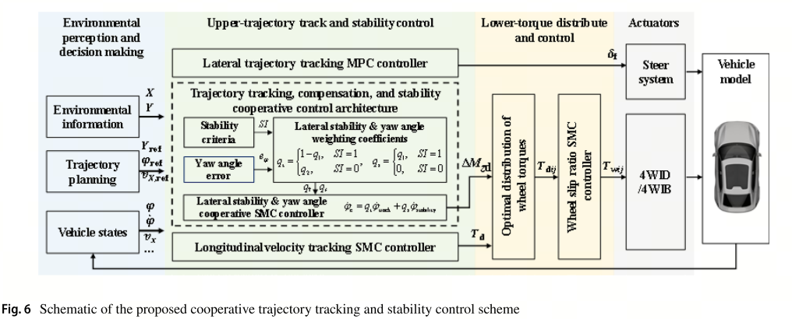

### **4.1 横向轨迹跟踪控制器**

为了实现横向轨迹跟踪，设计了一种基于mpc的控制器。在平衡模型精度和计算效率的基础上，采用正演欧拉法推导了时变轮胎刚度模型的离散控制器公式。与固定轮胎刚度模型相比，所采用的时变轮胎刚度模型在轮胎饱和区域具有较高的精度。离散状态方程由

#### 公式（18）：离散状态方程

$ 
\left\{
\begin{array}{l}
x_{k+1} = A_k x_k + B_k u_k + T_p w_k \\
y_k = C_k x_k
\end{array}
\right.
 $

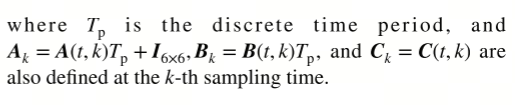

*   **公式推导**：该公式基于对连续时间状态空间方程 $\dot{x}(t) = Ax(t) + Bu(t) + w(t)$ 的离散化。采用前向欧拉法，将时间区间 $[t_k, t_{k + 1}]$ 内的连续变化近似为离散变化。假设在采样周期 $T_p = t_{k + 1} - t_k$ 内，系统矩阵 $A$ 和 $B$ 保持不变，对连续方程两边在时间区间上积分并近似可得：

$ 
x(t_{k + 1}) - x(t_k) \approx T_p (Ax(t_k) + Bu(t_k) + w(t_k))
 $

将 $t_k$ 时刻的状态记为 $x_k$，$t_{k + 1}$ 时刻的状态记为 $x_{k + 1}$，控制输入 $u(t_k)$ 记为 $u_k$，干扰 $w(t_k)$ 记为 $w_k$，输出 $y(t_k)$ 记为 $y_k$，即得到上述离散状态方程。

*   **变量解释**：

    *   $x_k$ 是系统在第 $k$ 时刻的状态向量，包含了车辆的纵向速度、横向速度、横摆角、横摆角速度等关键状态信息。
    
    *   $u_k$ 为第 $k$ 时刻的控制输入，在横向轨迹跟踪中主要指前轮转向角 $\delta_f$。
    
    *   $A_k$ 和 $B_k$ 是时变系数矩阵，其元素值由车辆动力学参数（如质量 $m$、转动惯量 $I_{zz}$、轮胎侧偏刚度 $C_{yf}$ 和 $C_{yr}$ 等）以及车辆当前状态（如速度 $v_x$、横摆角 $\varphi$ 等）决定。
    
    *   $T_p$ 是离散采样周期，其大小影响控制的实时性和准确性，这里取 10ms 是在计算资源和控制精度之间的权衡。
    
    *   $w_k$ 代表系统干扰，如路面不平、侧风等对车辆状态的影响。
    
    *   $C_k$ 为输出矩阵，用于从状态向量 $x_k$ 中提取出可观测的输出量，如横向位置、横摆角等。

*   **作用与意义**：为模型预测控制（MPC）提供了离散化的系统模型基础。MPC 通过该模型预测车辆未来的状态，进而求解出最优的控制输入序列，以实现对车辆横向轨迹的精确跟踪。

#### 公式（19）：扩展状态向量

$ 
\xi = \left[
\begin{array}{c}
x_k \\
u_{k-1}
\end{array}
\right]
 $

*   **设计思路**：直接对控制输入 $u_k$ 进行优化时，容易出现控制量的高频振荡，导致执行器磨损和控制效果不稳定。引入前一时刻的控制输入 $u_{k - 1}$，将问题转化为对控制增量 $\Delta u_k = u_k - u_{k - 1}$ 的优化，从而有效抑制控制量的剧烈变化。

*   **数学变换**：通过构建扩展状态向量 $\xi$，将原本的线性时变（LTV）系统转化为包含控制增量的线性系统形式，这种形式更便于应用二次规划（QP）算法进行求解，提高了控制器的计算效率和求解可行性。

*   **实际应用**：在实际的车辆控制中，使得控制器在调整前轮转向角时更加平滑，避免频繁大幅度的转向操作，提升了车辆行驶的舒适性和安全性。

#### 公式（20）：带控制增量的离散方程

$ 
\left\{
\begin{array}{l}
\xi_{k+1} = A_d \xi_k + B_d \Delta u_k + T_p \tilde{w}_k \\
y_k = C_d \xi_k
\end{array}
\right.
 $

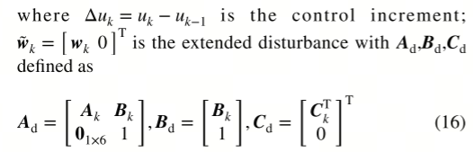

*   **公式推导**：基于扩展状态向量 $\xi$，将公式（18）中的状态方程进行改写。通过矩阵运算，将原系统矩阵 $A_k$、$B_k$ 与控制增量 $\Delta u_k$ 进行重新组合，得到新的系数矩阵 $A_d$、$B_d$ 和 $C_d$。同时，对干扰向量 $w_k$ 进行扩展得到 $\tilde{w}_k$，以匹配扩展状态向量的维度。

*   **变量说明**：

    *   $A_d$、$B_d$ 和 $C_d$ 是针对扩展状态向量 $\xi$ 重新构建的系数矩阵，它们包含了原系统矩阵与控制增量的映射关系，反映了系统状态和控制增量对未来状态和输出的影响。
    
    *   $\Delta u_k$ 为控制增量，是控制器实际优化的变量，通过调整 $\Delta u_k$ 来实现对车辆状态的控制。
    
    *   $\tilde{w}_k$ 是扩展后的干扰向量，包含了原干扰 $w_k$ 的信息以及为了匹配扩展状态向量维度而添加的零元素。

*   **作用体现**：此方程为基于控制增量的模型预测控制提供了核心的数学模型。在 MPC 算法中，通过该方程预测未来状态和输出，构建以控制增量为变量的二次规划目标函数，从而求解出最优的控制增量序列，实现对车辆横向轨迹的稳定跟踪。

#### 公式（21）：预测时域内的状态递推

$ 
\xi_{k+N_p} = A_d^{N_p} \xi_k + \sum_{i=0}^{N_p-1} A_d^{N_p-1-i} (B_d \Delta u_{k+i} + T_p \tilde{w}_{k+i})
 $

​      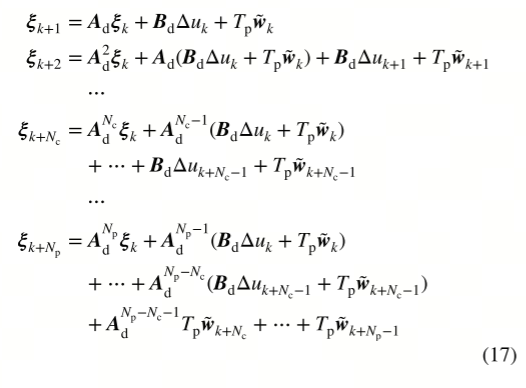

*   **推导过程**：通过对公式（20）进行迭代推导，从第 $k$ 时刻开始，逐步计算到第 $k + N_p$ 时刻的状态。利用状态转移矩阵 $A_d$ 的幂次运算和求和运算，将未来状态 $\xi_{k + N_p}$ 表示为初始状态 $\xi_k$、控制增量序列 $\Delta u_{k+i}$ 和干扰序列 $\tilde{w}_{k+i}$ 的函数。

*   **物理意义**：在预测时域 $N_p$ 内，该公式描述了车辆状态随时间的演变过程。其中，$A_d^{N_p} \xi_k$ 表示初始状态对未来状态的影响，体现了系统的动态特性；$\sum_{i=0}^{N_p-1} A_d^{N_p-1-i} B_d \Delta u_{k+i}$ 反映了控制增量序列对未来状态的作用，是控制器实现轨迹跟踪的关键；$\sum_{i=0}^{N_p-1} A_d^{N_p-1-i} T_p \tilde{w}_{k+i}$ 则考虑了干扰因素对车辆状态的影响，使得模型能够更准确地预测实际情况。

*   **应用场景**：在模型预测控制中，该公式用于计算未来预测时域内的车辆状态，为构建目标函数提供数据基础。控制器根据预测的状态与参考轨迹的偏差，优化控制增量序列，以实现对车辆轨迹的精确跟踪。

#### 公式（22）：系统输出预测

同样，Np中的输出向量y也有一个近似表达式。预测视界内的系统输出YA可以用k时刻的扩展状态向量、控制视界中的控制增量向量ΔU和预测视界W中的扰动向量来表示。状态空间方程由式给出:

$ 
Y_A = \Psi \xi_k + \Theta \Delta U + \Omega W
 $

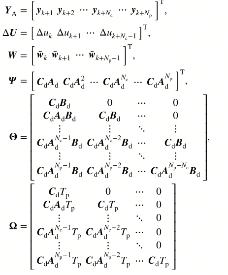

*   **公式构建**：根据公式（20）和（21），通过输出矩阵 $C_d$ 对预测的状态进行映射，得到系统输出预测方程。其中，$\Psi$、$\Theta$ 和 $\Omega$ 是通过对状态转移矩阵和输出矩阵进行运算得到的系数矩阵，它们分别反映了初始状态、控制增量序列和干扰序列对系统输出的影响。

*   **变量含义**：

    *   $Y_A$ 是预测时域内的系统输出向量，包含了如横向位置、横摆角等车辆关键输出信息。
    
    *   $\Psi$ 是与初始状态相关的系数矩阵，用于将初始状态向量 $\xi_k$ 映射到系统输出。
    
    *   $\Theta$ 是与控制增量序列相关的系数矩阵，描述了控制增量 $\Delta U$ 对系统输出的影响。
    
    *   $\Omega$ 是与干扰序列相关的系数矩阵，体现了干扰 $W$ 对系统输出的作用。
    
    *   $\Delta U$ 是预测时域内的控制增量序列，$W$ 是预测时域内的干扰序列。

*   **作用与价值**：该公式将系统输出误差转化为控制增量的函数，使得在模型预测控制的目标函数构建中，可以直接通过优化控制增量序列 $\Delta U$ 来最小化系统输出与参考轨迹之间的误差，从而实现对车辆横向轨迹的有效跟踪。

#### 公式（23）：目标函数

$ 
J = (Y_A - Y_{A,\text{ref}})^T Q_A (Y_A - Y_{A,\text{ref}}) + \Delta U^T R_A \Delta U
 $

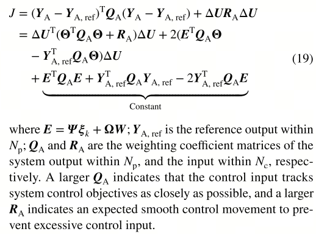

*   **函数构成**：此目标函数为二次型函数，由两部分组成。第一部分 $(Y_A - Y_{A,\text{ref}})^T Q_A (Y_A - Y_{A,\text{ref}})$ 用于衡量系统输出 $Y_A$ 与参考轨迹输出 $Y_{A,\text{ref}}$ 之间的误差，权重矩阵 $Q_A$ 用于调整不同输出变量（如横向位置、横摆角等）的跟踪精度权重；第二部分 $\Delta U^T R_A \Delta U$ 用于惩罚控制增量序列 $\Delta U$ 的变化，权重矩阵 $R_A$ 用于调节控制量的平滑程度，避免控制输入的剧烈变化。

*   **参数选择**

    *   $Q_A$ 的元素取值根据对不同输出变量的跟踪精度要求而定，例如，若对横向位置跟踪要求较高，则增大对应横向位置的权重值。
    
    *   $R_A$ 的取值需要综合考虑车辆执行器的性能和控制效果，较大的 $R_A$ 值会使控制输入更加平滑，但可能会降低轨迹跟踪的快速性；较小的 $R_A$ 值则反之。

*   **优化目标**：在模型预测控制中，通过求解该目标函数的最小值，得到最优的控制增量序列 $\Delta U$，从而在保证车辆轨迹跟踪精度的同时，实现控制输入的平滑性，提高车辆行驶的稳定性和舒适性。

#### 公式（24）：控制输入约束

$ 
\begin{cases}
u_{\text{min}} \leq u \leq u_{\text{max}} \\
\Delta u_{\text{min}} \leq \Delta u \leq \Delta u_{\text{max}}
\end{cases}
 $

*   **约束原因**：由于车辆的前轮转向角等控制输入受到物理执行器的限制，存在最大和最小取值范围。同时，为了避免控制输入的剧烈变化，对控制增量也需要进行约束。这些约束条件确保了控制器输出的控制量在实际车辆能够执行的范围内，防止执行器饱和或机械损伤，保证车辆的安全运行。

*   **约束作用**：在模型预测控制的优化过程中，将这些约束条件作为限制条件加入到二次规划问题中，使得求解得到的控制增量序列 $\Delta U$ 和控制输入 $u$ 满足实际物理约束，增强了控制器的实用性和可靠性。

#### 公式（25）：轮胎侧偏角约束

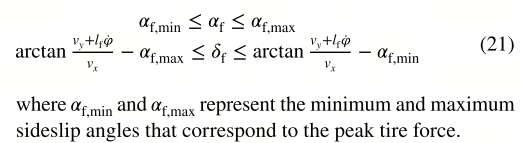

*   **约束依据**：轮胎的侧偏角直接影响轮胎的抓地力和车辆的操控性能。当轮胎侧偏角超过一定范围时，轮胎会进入饱和区，导致抓地力下降，车辆容易出现失控等危险情况。因此，需要对前轮侧偏角 $\alpha_f$ 进行约束，使其保持在轮胎能够提供有效抓地力的范围内。

*   **实现方式**：通过控制前轮转向角 $\delta_f$ 间接控制侧偏角 $\alpha_f$，在控制器的设计中，将侧偏角约束转化为对转向角的约束条件，与控制输入约束一起参与模型预测控制的优化过程，确保车辆在各种工况下都能保持良好的操控稳定性。

#### 将MPC转化为二次规划问题

基于mpc的轨迹跟踪控制器可以重新表述为二次规划问题，由式给出

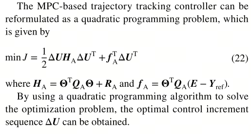

### 4.2 横摆稳定性与横摆角补偿控制器

横摆稳定控制系统以恒定转向机动时横摆角速度的稳态值为控制目标。这通常用于表征车辆的稳定状态。而偏航角误差补偿控制以参考弹道的偏航角和横航速为控制目标，反映飞行器的机动性能。两者都是偏航方向的运动控制，因此可以构造一个同时实现偏航稳定性控制和偏航角误差补偿控制的控制器，以简化控制器结构。

期望值、控制目标、滑模面：

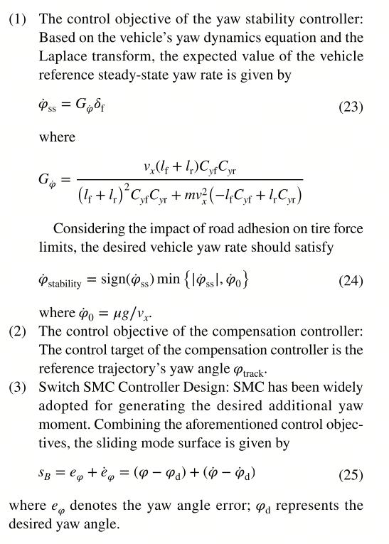

#### 公式（26）：横摆角速度微分方程&#xA;

$ 
\ddot{\varphi} = -\frac{l_f C_f - l_r C_r}{I_{zz}} \beta - \frac{l_f^2 C_f + l_r^2 C_r}{I_{zz} v_x} \dot{\varphi} + \frac{l_f C_f}{I_{zz}} \delta_f + \frac{\Delta M_z}{I_{zz}}
 $

*   **公式推导**：基于车辆动力学理论，考虑车辆的受力和运动关系推导得出。该方程描述了车辆横摆角速度 $\ddot{\varphi}$ 的变化率与质心侧偏角 $\beta$、横摆角速度 $\dot{\varphi}$、前轮转向角 $\delta_f$ 以及附加横摆力矩 $\Delta M_z$ 之间的关系。其中各项分别来源于车辆的侧向力、轮胎侧偏力、转向力以及主动施加的横摆力矩对横摆运动的影响。

*   **项分析**：

    *   $-\frac{l_f C_f - l_r C_r}{I_{zz}} \beta$ 项：反映了质心侧偏角 $\beta$ 对横摆角速度的影响，体现了车辆的不足转向或过度转向特性。当 $l_f C_f - l_r C_r > 0$ 时，车辆表现为不足转向；反之则为过度转向。
    
    *   $-\frac{l_f^2 C_f + l_r^2 C_r}{I_{zz} v_x} \dot{\varphi}$ 项：是横摆角速度的阻尼项，由轮胎侧偏刚度和车辆转动惯量决定，随着车速 $v_x$ 的增加，该项的阻尼作用增强，有助于车辆的横摆稳定性。
    
    *   $\frac{l_f C_f}{I_{zz}} \delta_f$ 项：表示前轮转向角 $\delta_f$ 产生的横摆力矩，是车辆转向时横摆运动的主要驱动力之一。
    
    *   $\frac{\Delta M_z}{I_{zz}}$ 项：为主动附加横摆力矩 $\Delta M_z$ 对横摆角速度的影响，通过施加该力矩可以补偿轨迹跟踪误差或抑制车辆的横摆不稳定趋势。

*   **应用意义**：为横摆稳定性控制器的设计提供了动力学模型基础。通过对该方程的分析和控制，可以实现对车辆横摆运动的有效调节，提高车辆在转向等工况下的稳定性。

#### 公式（27）：指数趋近律

$ 
\dot{s}_B = -\varepsilon_B \text{sign}(s_B) - k_B s_B
 $

*   **理论基础**：该公式是滑动模态控制（SMC）中的一种趋近律，用于迫使系统状态快速收敛到滑动面 $s_B = e_\varphi + \dot{e}_\varphi$，其中 $e_\varphi$ 为横摆角误差。其原理是通过设计合适的趋近律，使系统在有限时间内到达滑动面，并在滑动面上保持稳定运动，从而实现对系统的鲁棒控制。

*   **参数作用**：

    *   $\varepsilon_B$ 为常速收敛项系数，其值越大，系统状态向滑动面收敛的速度越快，但同时也会增加抖振的风险。在实际应用中，需要通过实验和调试来选取合适的 $\varepsilon_B$ 值，以平衡收敛速度和抖振。
    
    *   $k_B$ 是指数收敛项系数，决定了指数衰减的速率。较大的 $k_B$ 值可以使系统状态更快地趋近于滑动面，通常取值使得系统能够在较短时间（如 100ms）内快速收敛。

*   **改进措施**：为了减少传统符号函数 $\text{sign}(s_B)$ 带来的抖振问题，在实际控制器设计中，常采用饱和函数 $\text{sat}(s_B/\phi)$ 替代 $\text{sign}(s_B)$，其中 $\phi$ 为边界层厚度，通过合理设置 $\phi$ 的值，可以有效降低抖振，提高控制器的性能。

#### 公式（28）：期望附加横摆力矩&#xA;

$ 
\Delta M_{z,\text{des}} = I_{zz} \left[ \frac{l_f C_f - l_r C_r}{I_{zz}} \beta + \frac{l_f^2 C_f + l_r^2 C_r}{I_{zz} v_x} \dot{\varphi} - \frac{l_f C_f}{I_{zz}} \delta_f - \varepsilon_B \text{sign}(s_B) - k_B s_B \right]
 $

*   **推导过程**：基于公式（26）的横摆角速度微分方程和公式（27）的指数趋近律，通过令 $\ddot{\varphi}$ 满足滑动模态控制的要求，即系统状态快速收敛到滑动面，对公式（26）进行变形求解，得到期望的附加横摆力矩 $\Delta M_{z,\text{des}}$ 的表达式。

*   **物理意义**：该公式计算出的 $\Delta M_{z,\text{des}}$ 是为了使车辆横摆运动满足控制目标所需的附加横摆力矩。其中包含了车辆动力学特性相关项（如质心侧偏角、横摆角速度、前轮转向角等引起的力矩）以及滑动模态控制的趋近律

### **4.3 合作轨迹跟踪与稳定性控制**

稳定性准则模块用于评估基于当前车辆状态的车辆偏航稳定性。如果车辆处于不稳定状态，则触发偏航稳定控制;否则，将触发偏航角补偿控制。偏航角误差补偿控制与偏航稳定性控制的切换机理如图图所示。为减少控制器干预的影响，提出一种综合协同控制策略:

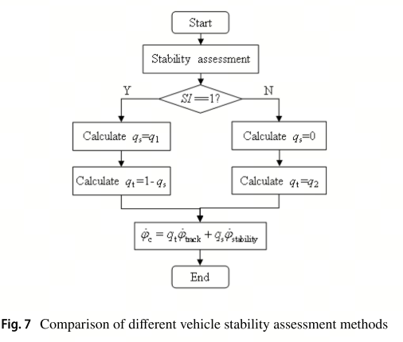

#### **公式（29）：横摆角速度控制目标**

$ 
\dot{\varphi}_c = q_t \dot{\varphi}_{\text{track}} + q_s \dot{\varphi}_{\text{stability}}
 $

*   **含义**：该公式为横摆角速度的综合控制目标表达式，通过权重系数 $q_t$ 和 $q_s$ 对轨迹跟踪目标横摆角速度 $\dot{\varphi}_{\text{track}}$ 和稳定性目标横摆角速度 $\dot{\varphi}_{\text{stability}}$ 进行加权求和 。

*   **作用**：根据车辆实时行驶状态，动态调整横摆角速度的控制倾向。当车辆处于稳定状态时，增大 $q_t$ 使车辆更注重跟踪预定轨迹；当车辆面临失稳风险，如在低附着路面行驶时，增大 $q_s$ ，优先保障车辆的横摆稳定性。

*   **推导逻辑**：基于车辆在不同工况下对轨迹跟踪和稳定性需求的不同，采用加权组合的方式构建一个统一的横摆角速度控制目标，实现两者的平衡。
*   其中qt和qs为对偶调节，包括稳定性调节系数q1和误差补偿调节系数q2。较大的qt表明增加的偏航力矩有减小轨迹跟踪误差的趋势，而较大的qs表明增加的偏航稳定性有提高的趋势。

#### **公式（30）：权重系数切换逻辑**

$ 
q_t = \begin{cases} 1 - q_1, & SI=1 \\ q_2, & SI=0 \end{cases}, \quad q_s = \begin{cases} q_1, & SI=1 \\ 0, & SI=0 \end{cases}
 $

*   **含义**：这里定义了权重系数 $q_t$ 和 $q_s$ 的切换规则，依据车辆的稳定指数 $SI$ 进行判断。当 $SI = 1$ 表示车辆处于不稳定状态，当 $SI = 0$ 表示车辆处于稳定状态 。

*   **作用**：明确了车辆在稳定和不稳定两种状态下，轨迹跟踪权重和稳定性权重的具体取值，使得控制器能够根据车辆状态及时切换控制策略。

*   **推导逻辑**：从实际控制需求出发，将车辆状态简化为稳定和不稳定两种情况，分别赋予不同的权重取值，以实现控制策略的有效切换。

#### **公式（31）：稳定性权重系数的计算**

$ 
q_1 = \begin{cases} \frac{e^\lambda - 1}{e^{\lambda_0} - 1}, & 0 \leq \lambda \leq \lambda_0 \\ 1, & \lambda > \lambda_0 \end{cases}, \quad \lambda = \sqrt{p \left(\frac{\dot{\varphi}}{\dot{\varphi}_0}\right)^2 + \frac{1}{4} \sum \frac{F_{xij}^2 + F_{yij}^2}{(\mu F_{zij})^2}}
 $

稳定性调整由车辆的偏航率和轮胎利用率决定，其比例使用权重指数$$\lambda$$进行调整。当0≤$$\lambda$$≤$$\lambda_{0}$$时，同时考虑轨迹跟踪补偿和偏航稳定性控制;如果当$$\lambda$$>$$\lambda_{0}$$时，稳定性控制优先于轨迹跟踪补偿。

*   **含义**：公式中 $\lambda$ 是一个综合评估指标，它结合了横摆角速度 $\dot{\varphi}$ 与临界横摆角速度 $\dot{\varphi}_0$ 的比值关系，以及各车轮的纵向力 $F_{xij}$、侧向力 $F_{yij}$ 与附着力 $\mu F_{zij}$ 的关系。$q_1$ 根据 $\lambda$ 的大小进行取值，当 $\lambda$ 较小时，$q_1$ 较小，随着 $\lambda$ 增大，$q_1$ 逐渐增大，当 $\lambda$ 超过阈值 $\lambda_0$ 时，$q_1$ 取 1 。

*   **作用**：$q_1$ 用于在车辆接近不稳定状态时，动态调整稳定性控制的权重。通过 $\lambda$ 综合评估车辆的危险程度，使得 $q_1$ 能够平滑地变化，避免控制权重的突变，从而实现稳定性控制干预程度与车辆危险程度的匹配。

*   **推导逻辑**：基于对车辆不稳定因素的分析，选取横摆角速度和轮胎力利用情况作为关键评估指标，构建 $\lambda$ 来量化车辆的不稳定程度，再通过合适的函数关系确定 $q_1$ 的取值。
*   其中p为设为2的权重调整系数。调节系数q1与功率因数$$\lambda$$的关系如图图8所示。
*   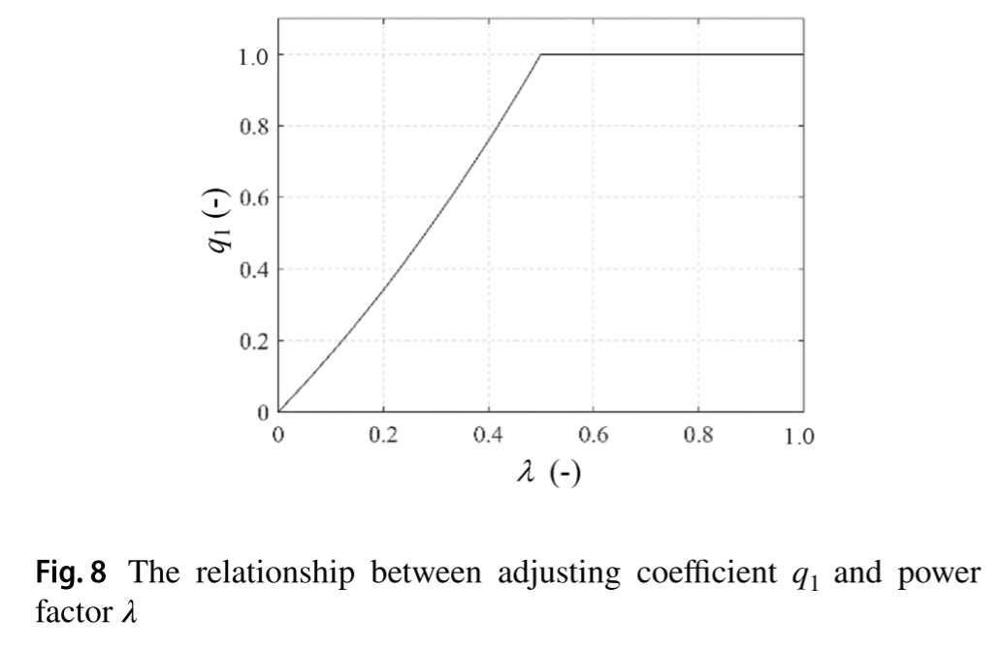

#### **公式（32）：轨迹跟踪权重系数的计算**

为避免补偿模块在轨迹跟踪误差较小时的不良干预，利用q2建立了触发补偿控制的干预条件，并构造了一个五阶多项式以保证平滑干预和退出。

$ 
q_2 = \begin{cases} 0, & |e_\varphi| \leq e_{s\varphi} \\ \sum_{i=0}^5 a_i (|e_\varphi| - e_{s\varphi})^i, & e_{s\varphi} < |e_\varphi| \leq e_{e\varphi} \\ 1, & |e_\varphi| > e_{e\varphi} \end{cases}
 $

*   **含义**：该公式根据横摆角误差 $e_\varphi$ 的大小确定轨迹跟踪权重系数 $q_2$ 。当横摆角误差小于等于较小阈值 $e_{s\varphi}$ 时，$q_2$ 取 0 ；当误差在 $e_{s\varphi}$ 和较大阈值 $e_{e\varphi}$ 之间时，$q_2$ 由一个关于误差的五次多项式计算得出；当误差大于 $e_{e\varphi}$ 时，$q_2$ 取 1 。

*   **作用**：避免在横摆角误差较小时过度进行轨迹跟踪补偿，减少不必要的控制动作，确保车辆在稳定状态下的行驶平顺性。只有当误差超过一定程度时，才逐渐增加轨迹跟踪的权重，以纠正车辆的行驶轨迹。

*   **推导逻辑**：考虑到在小误差情况下不需要过多干预，同时在大误差时需要快速调整，采用分段函数的形式，利用五次多项式在中间误差区间实现 $q_2$ 的平滑过渡。
*   其中，$a_{i}$ 是加权系数；$\vert e_{s\varphi}\vert$ 是补偿控制未激活时 $e_{\varphi}$ 的最大误差；$\vert e_{c\varphi}\vert$ 是补偿控制激活时 $e_{\varphi}$ 的最小误差。调节系数 $q_{2}$ 与偏航角误差 $e_{\varphi}$ 之间的关系如图 9 所示。
*   

### **4.4 纵向速度跟踪控制器**

#### **公式（33）：滑动面设计**

$ 
s_D = e_{v_X}, \quad \dot{s}_D = \dot{e}_{v_X}
 $

*   **含义**：定义滑动面 $s_D$ 为纵向速度误差 $e_{v_X} = v_X - v_{X,\text{ref}}$，即实际纵向速度 $v_X$ 与参考纵向速度 $v_{X,\text{ref}}$ 的差值；$\dot{s}_D$ 为滑动面的导数，也就是纵向速度误差的变化率 。

*   **作用**：将纵向速度跟踪问题转化为滑动模态控制问题，通过设计合适的控制律，迫使系统状态在有限时间内到达滑动面，并在滑动面上保持运动，从而实现纵向速度对参考速度的快速跟踪和稳定控制。

*   **推导逻辑**：基于滑动模态控制理论，选取能够反映系统控制目标偏差的量作为滑动面，利用滑动模态的特性实现系统的稳定控制。

根据方程(8)，忽略总行驶阻力，得到x方向的全局车辆模型为

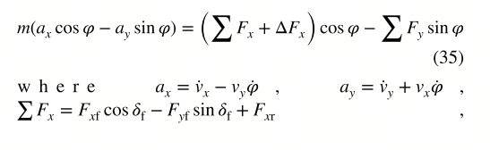

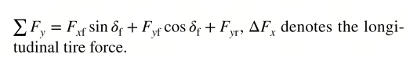

#### **公式（34）：期望纵向轮胎力**

采用方程(27)中的趋近律进行SMC控制器设计。理想的纵向轮胎力可推导为

$ 
\Delta F_{x,\text{des}} = \frac{1}{\cos\varphi} \left[ -\sum F_{xij} \cos\varphi + \cdots - \varepsilon_D \text{sign}(s_D) - k_D s_D \right]
 $

*   **含义**：公式用于计算期望的纵向轮胎力 $\Delta F_{x,\text{des}}$ 。其中包含了当前各车轮纵向力在车辆行驶方向的合力项 $-\sum F_{xij} \cos\varphi$ ，以及基于滑动模态控制的趋近律项 $ - \varepsilon_D \text{sign}(s_D) - k_D s_D$ ，$\varepsilon_D$ 和 $k_D$ 为控制参数 。

*   **作用**：通过计算期望的纵向轮胎力，为车辆的驱动或制动系统提供控制指令，以调节车辆的纵向速度，使其跟踪参考速度。趋近律项能够快速消除纵向速度误差，克服外界干扰对速度控制的影响。

*   **推导逻辑**：依据车辆纵向动力学模型和滑动模态控制理论，结合车辆行驶方向的力平衡关系，推导出期望纵向轮胎力的表达式。

### **4.5 车轮力矩优化分配与滑移率控制**

\*来自横摆稳定性控制器的附加横摆力矩输出和来自纵向速度跟踪控制器的总纵向轮胎力，被作为车轮转矩分配模块的输入。通过滑移率控制算法，$\vert \kappa_{ij}\vert$ 被调节在 0.1 以内。假设 $\Delta \omega_{w}\approx0$，根据单轮车辆动力学模型，每个车轮的总驱动或制动力矩可近似表示为:

#### **公式（35）：单轮动力学方程**

$ 
I_w \dot{\omega}_{ij} = -F_{xij} R_w + T_{ij}
 $

*   **含义**：该方程描述了单个车轮的旋转动力学特性。其中 $I_w$ 为车轮转动惯量，$\dot{\omega}_{ij}$ 为车轮角加速度，$F_{xij}$ 为车轮所受纵向力，$R_w$ 为车轮半径，$T_{ij}$ 为作用在车轮上的驱动力矩 。

*   **作用**：建立了车轮所受力矩与纵向力、角加速度之间的关系，为后续进行车轮力矩优化分配和滑移率控制提供了动力学基础，是分析车轮运动状态和控制车轮力矩的关键方程。

*   **推导逻辑**：根据牛顿第二定律在旋转运动中的应用，对单个车轮进行受力分析，得出其动力学方程。

#### **公式（36）：等效驱动力矩**

$ 
T_{ij} = F_{xij} R_w
 $

*   **含义**：在特定条件下（如忽略车轮角加速度，即 $\dot{\omega}_{ij} \approx 0$ ），车轮所受纵向力与车轮半径的乘积等效为驱动力矩 。

*   **作用**：简化了车轮力矩的计算，在一些不需要精确考虑车轮动态变化的情况下，便于快速计算所需的驱动力矩，为车轮力矩的初步分配和控制提供了简便的计算方法。

* **推导逻辑**：当车轮角加速度较小时，认为车轮处于近似匀速转动状态，根据力矩与力的关系直接推导得出。

  \*其中，$I_{w}$ 表示车轮的转动惯量；$T_{ij}$ 表示每个车轮的驱动 / 制动力矩。因此，与期望纵向控制力对应的期望等效转矩 $T_{des}$ 可推导为 $\Delta F_{x,des}R_{w}$。

#### **公式（37）：目标函数（力矩分配优化）**

\*为使轮胎载荷最小，构建目标函数如下：

$$\min J = Q_{E}(\Delta M_{z,\text{real}} - \Delta M_{z,\text{des}})^2 + R_{E}\sum\frac{T_{ij}^2}{(\mu F_{zij}R_{w})^2} \tag{39}$$

其中，$\Delta M_{z,\text{real}}$ 是由车轮转矩最优分配产生的实际附加横摆力矩；$Q_{E}$ 表示附加横摆力矩的权重，$Q_{E}$ 越大，控制系统越期望跟踪横摆力矩；$R_{E}$ 表示轮胎利用率的权重，其值越大，表明在车轮转矩分配过程中应尽可能使路面附着利用率最小；$\rho$ 表示松弛因子。

为防止总纵向轮胎力和期望横摆力矩超出约束，引入松弛因子 $\varepsilon$ 及其权重系数 $\rho$，如下：

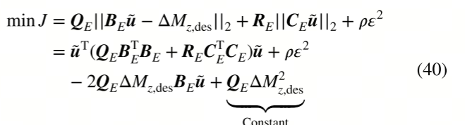

其中 $\tilde{\boldsymbol{u}} = [T_{\mathrm{fl}}, T_{\mathrm{fr}}, T_{\mathrm{rl}}, T_{\mathrm{rr}}]^{\mathrm{T}}$，$\boldsymbol{B}_{E} = \frac{1}{R_{w}}[-l_{\mathrm{w}}\cos\delta_{\mathrm{f}} + l_{\mathrm{f}}\sin\delta_{\mathrm{f}}, l_{\mathrm{w}}\cos\delta_{\mathrm{f}} + l_{\mathrm{f}}\sin\delta_{\mathrm{f}}, -l_{\mathrm{w}}, l_{\mathrm{w}}]$  且  $\boldsymbol{C}_{E} = \frac{1}{(\mu R_{\mathrm{w}})^2}\mathrm{diag}(F_{\mathrm{zl}}^{-2}, F_{\mathrm{zfr}}^{-2}, F_{\mathrm{zlr}}^{-2}, F_{\mathrm{zrr}}^{-2})$。

执行器的约束条件由下式给出：

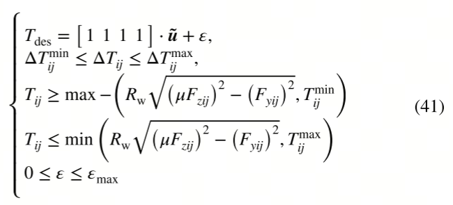

其中 $T_{ij}^{\min}$ 和 $T_{ij}^{\max}$ 分别表示车轮转矩的最小值和最大值；$\Delta T_{ij}^{\min}$ 和 $\Delta T_{ij}^{\max}$ 分别是车轮转矩增量的最小值和最大值；$\varepsilon$ 是松弛因子。

$ 
\min J = Q_E (\Delta M_{z,\text{real}} - \Delta M_{z,\text{des}})^2 + R_E \sum \frac{T_{ij}^2}{(\mu F_{zij} R_w)^2}
 $

*   **含义**：这是一个用于车轮力矩优化分配的目标函数。其中第一项 $Q_E (\Delta M_{z,\text{real}} - \Delta M_{z,\text{des}})^2$ 用于衡量实际产生的横摆力矩 $\Delta M_{z,\text{real}}$ 与期望横摆力矩 $\Delta M_{z,\text{des}}$ 的误差，通过权重系数 $Q_E$ 调整其重要程度；第二项 $R_E \sum \frac{T_{ij}^2}{(\mu F_{zij} R_w)^2}$ 用于评估各车轮驱动力矩 $T_{ij}$ 的大小，以避免轮胎力过载，$R_E$ 为相应的权重系数 。

*   **作用**：通过最小化该目标函数，在满足车辆横摆力矩需求的同时，均衡分配各车轮的力矩，避免单个车轮轮胎力过大导致打滑，提高车辆行驶的稳定性和轮胎使用寿命。

*   **推导逻辑**：综合考虑车辆横摆稳定性需求和轮胎力约束条件，构建包含横摆力矩误差和轮胎力相关项的目标函数，通过优化该函数实现合理的力矩分配。

#### **公式（38）：带松弛因子的约束优化**

$ 
\min J = \frac{1}{2} u_E^T H_E u_E + f_E^T u_E
 $

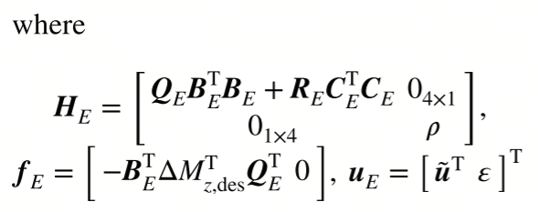

*   **含义**：将车轮力矩分配问题转化为带约束的二次规划（QP）问题。其中 $u_E$ 是包含四轮力矩和松弛因子的优化变量向量，$H_E$ 为二次型系数矩阵，$f_E$ 为线性项系数向量 。

*   **作用**：引入松弛因子后，在存在约束条件（如轮胎力极限、执行器限制等）且可能出现不可行解的情况下，允许一定程度的误差，使优化问题能够求解，提高控制器的鲁棒性，确保在复杂工况下仍能实现有效的力矩分配。

*   **推导逻辑**：基于二次规划理论，将目标函数和约束条件进行转化，构建标准的二次规划形式，以便利用成熟的优化算法进行求解。

提出了一种事件触发的轮滑比控制器，在保证低轮滑比的同时保证车轮力矩的精确执行。如果车轮打滑率超过触发阈值并保持5ms以上，则SMC控制器将被激活;如果滑移率低于触发阈值并保持超过10ms, SMC控制器将失效。给出了轮滑比控制器的滑模曲面和到达规律:

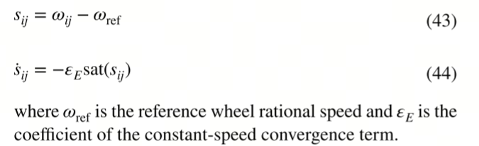

#### **公式（39）：滑移率控制触发条件**

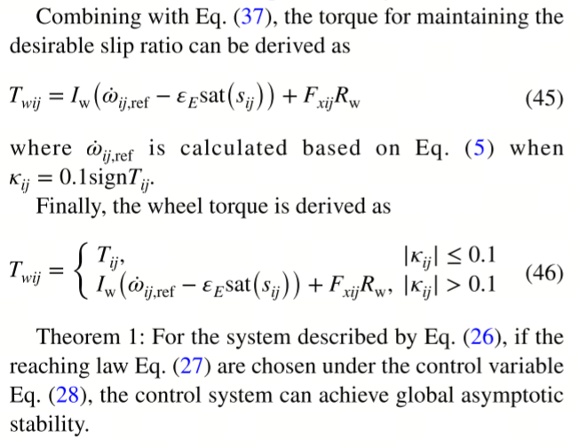

$ 
T_{wij} = \begin{cases} T_{ij}, & |\kappa_{ij}| \leq 0.1 \\ I_w (\dot{\omega}_{ij,\text{ref}} - \varepsilon_E \text{sat}(s_{ij})) + F_{xij} R_w, & |\kappa_{ij}| > 0.1 \end{cases}
 $

*   **含义**：根据车轮滑移率 $\kappa_{ij}$ 的大小决定车轮力矩的控制策略。当滑移率绝对值小于等于 0.1 时，车轮力矩采用正常的分配值 $T_{ij}$ ；当滑移率绝对值大于 0.1 时，触发滑移率控制，通过调整力矩 $T_{wij}$ 来抑制滑移，其中 $\dot{\omega}_{ij,\text{ref}}$ 为参考角速度，$\varepsilon_E$ 为控制参数，$\text{sat}(s_{ij})$ 为饱和函数 。

*   **作用**：防止车轮在低附着路面或急加速、急制动等情况下出现过度滑移，导致车辆失控。通过实时监测滑移率并及时调整车轮力矩，提高车辆在复杂路况下的行驶安全性和操控性。

*   **推导逻辑**：基于对车轮滑移现象的研究和控制需求，设定滑移率阈值，当超过阈值时，结合车轮动力学特性和控制理论设计相应的力矩调整策略。

## 第五章：所提控制方案的稳定性分析

为了保证所提控制方案的可靠性，必须对纵向控制器和横向控制器进行稳定性分析。

### **5.1 纵向控制器稳定性分析**

#### **公式（47）：Lyapunov 函数构造**

$ 
V = \frac{1}{2} s^T s \quad (47)
 $

*   **公式背景与推导**：该公式用于纵向速度跟踪控制器（SMC）的稳定性证明，是滑动模态控制（SMC）中典型的 Lyapunov 函数形式。其中，$s = e_{v_X}$ 为纵向速度误差向量（$e_{v_X} = v_X - v_{v_{X,\text{ref}}}$）。Lyapunov 函数选择为误差能量的二次型，利用正定函数特性证明系统稳定性。

*   **物理意义**：$V$ 表示系统误差的能量度量，其值恒非负，且仅当误差 $s = 0$ 时取最小值 0，满足 Lyapunov 函数的正定条件。通过分析 $V$ 的导数 $\dot{V}$ 的符号，可判断系统是否渐近稳定。

*   **文档关联**：公式（47）在段落中提出，用于纵向控制器的稳定性验证，通过构造该函数并推导其导数，证明 SMC 算法的收敛性。

#### **公式（48）：Lyapunov 函数导数**

$ 
\dot{V}(x, t) = s \cdot \dot{s} \leq 0 \quad (48)
 $

*   **推导过程**：对公式（47）求导，结合滑动面导数 $\dot{s} = \dot{e}_{v_X}$ 和指数趋近律 $\dot{s} = -\varepsilon_D \text{sign}(s) - k_D s$，可得：

$ 
  \dot{V} = s \cdot (-\varepsilon_D \text{sign}(s) - k_D s) = -\varepsilon_D |s| - k_D s^2
   $

由于 $\varepsilon_D > 0$ 和 $k_D > 0$，$\dot{V}$ 恒小于等于 0，满足 Lyapunov 稳定性条件。

*   **物理意义**：$\dot{V} \leq 0$ 表明系统误差能量随时间单调递减，最终收敛至零，即纵向速度误差 $e_{v_X}$ 渐近稳定。该公式验证了 SMC 控制器在纵向速度跟踪中的稳定性。

*   **文档关联**：公式（48）在段落中用于证明纵向控制器的 Lyapunov 稳定性，说明滑动模态控制的收敛性。
*   \*根据滑模控制（SMC）的指数趋近律，$s$ 和 $\dot{s}$ 的符号相反。也就是说，当 $\dot{s}<0$ 时，$s > 0$；当 $\dot{s}>0$ 时，$s < 0$；当 $\dot{s} = 0$ 时，$s = 0$。因此，保证了 $\dot{V}\leq0$，从而确保李雅普诺夫稳定性。同样，横摆稳定性与横摆角补偿控制器（式 (28)）以及车轮滑移率控制器（式 (45)）的设计规律也满足李雅普诺夫稳定性准则。

### **5.2 横向控制器稳定性分析**

为实现横向轨迹跟踪，设计了MPC和SMC控制器。所提出的轨迹跟踪稳定控制系统的抽象体系结构如图图10所示。

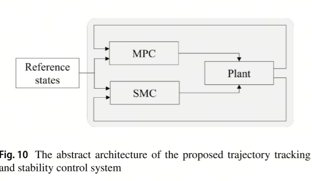

首先分析了MPC对SMC的影响。MPC轨迹跟踪控制主要通过前轮转向角影响参考横摆角速度，进而影响SMC输出附加横摆力矩。因此，只有证明SMC的稳定性，才能保证横向稳定和偏航角补偿系统的稳定性。对于SMC稳定性分析，读者可以参考5.1小节了解详细信息。本文重点分析了基于smc的附加偏航力矩对基于mpc的前轮转向控制的影响。将一个额外的偏航力矩作为系统扰动，如方程(13)所示，将系统变换为

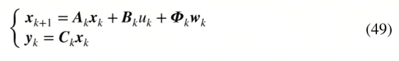

其中 $\boldsymbol{w}_{k} = [\Delta F_{x,\text{des}}, 0, 0, \Delta M_{z,\text{des}}, 0, 0]$；$\boldsymbol{\varPhi}_{k}$ 可表示为

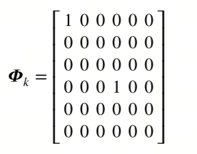

系统扰动 $\Delta F_{x,\text{des}}$ 和 $\Delta M_{z,\text{des}}$ 是有界的，由执行器和路面摩擦决定。系统稳定性分析可转化为扰动有界的模型预测控制（MPC）稳定性问题。值得注意的是，MPC 具有一定的鲁棒性。这是因为状态 $\boldsymbol{x}_{k + 1}$ 由 $\boldsymbol{x}_{k}$ 和 $u_{k}$ 共同决定，而输入 $u_{k}$ 是通过当前状态反馈 $\boldsymbol{x}_{k}$ 和参考状态进行优化的。当前状态反馈 $\boldsymbol{x}_{k}$ 是外部扰动 $\boldsymbol{w}_{k}$ 共同作用的结果。因此，控制变量 $u_{k}$ 具有一定的鲁棒性。MPC 的稳定性分析如下：

根据式 (19)，目标函数可表示为

$ J_{k} = \sum_{i = 1}^{N} \ell(\hat{\boldsymbol{x}}_{k + i|k}, \hat{u}_{k + i - 1|k}) \tag{51}$

其中 $\ell(\boldsymbol{x}, u) \geq 0$，当且仅当 $\boldsymbol{x} = 0$ 且 $u = 0$ 时，$\ell(\boldsymbol{x}, u) = 0$。同时，终端约束应满足:

#### **公式（52）：终端约束条件**

$ 
\hat{x}_{k+N | k} = 0 \quad (52)
 $

*   **公式作用**：模型预测控制（MPC）的终端约束条件，要求预测时域 $N$ 后的状态 $\hat{x}_{k+N | k}$ 强制归零。该约束是 MPC 稳定性证明的关键，确保闭环系统在有限时间内收敛到原点。

*   **数学意义**：通过引入终端约束，将 MPC 问题转化为带终端惩罚的优化问题，结合 Lyapunov 理论证明系统渐近稳定。该约束保证了预测状态在终端时刻的可控性。

*   **文档关联**：公式（52）在段落中作为 MPC 稳定性分析的前提条件，与状态约束（公式 53）共同确保优化问题的可行性。

#### **公式（53）：状态与输入约束**

$ 
\hat{x}_{k+i | k} \in X, \quad \hat{u}_{k+i | k} \in U \quad (53)
 $

*   **约束内容**：

    *   $\hat{x}_{k+i | k}$：预测状态需位于可行状态集 $X$（如速度、横摆角等物理可行范围）。

    *   $\hat{u}_{k+i | k}$：控制输入需位于执行器可行集 $U$（如转向角、驱动力矩限制）。

*   **稳定性关联**：确保优化过程中状态和输入始终在物理可行范围内，避免控制器输出超出执行器能力，辅助证明 MPC 闭环系统的鲁棒性。文档段落中提到该约束与终端约束（公式 52）共同构成 MPC 稳定性分析的基础。

#### **公式（55）：目标函数递推关系**

本文利用Lyapunov函数来证明MPC的稳定性。我们的目标是为这个系统找出一个Lyapunov函数它是正定的并且导数是负定的。所选择的Lyapunov函数为方程(19)所示的代价函数。在前面的假设(参见方程(51)至(53))中已经澄清了它的肯定性。因此，重点是证明其导数的负确定性。分析过程概述如下。

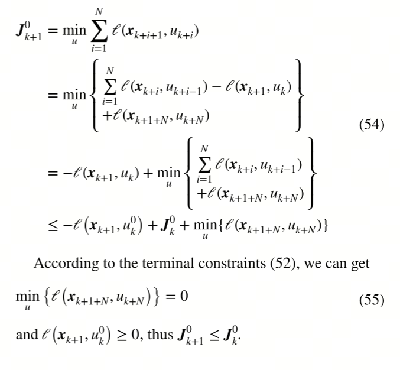

$ 
\min_u \{\ell(x_{k+1+N}, u_{k+N})\} = 0 \quad (55)
 $

*   **推导逻辑**：基于 MPC 的滚动时域优化特性，下一时刻的最优目标函数值 $J_{k+1}^0$ 不大于当前值 $J_k^0$ 减去当前阶段的代价项 $\ell(x_{k+1}, u_k^0)$。结合终端约束（公式 52），终端时刻代价 $\ell(x_{k+1+N}, u_{k+N})$ 为零，故有：

$ 
  J_{k+1}^0 \leq J_k^0 - \ell(x_{k+1}, u_k^0)
   $

由于 $\ell(x_{k+1}, u_k^0) \geq 0$，目标函数单调递减且有下界，确保系统渐近稳定。

*   **物理意义**：该递推关系表明 MPC 的代价函数随时间单调减小，最终收敛至最小值，验证了闭环系统的稳定性。公式（55）在段落中用于推导 MPC 的 Lyapunov 稳定性。

